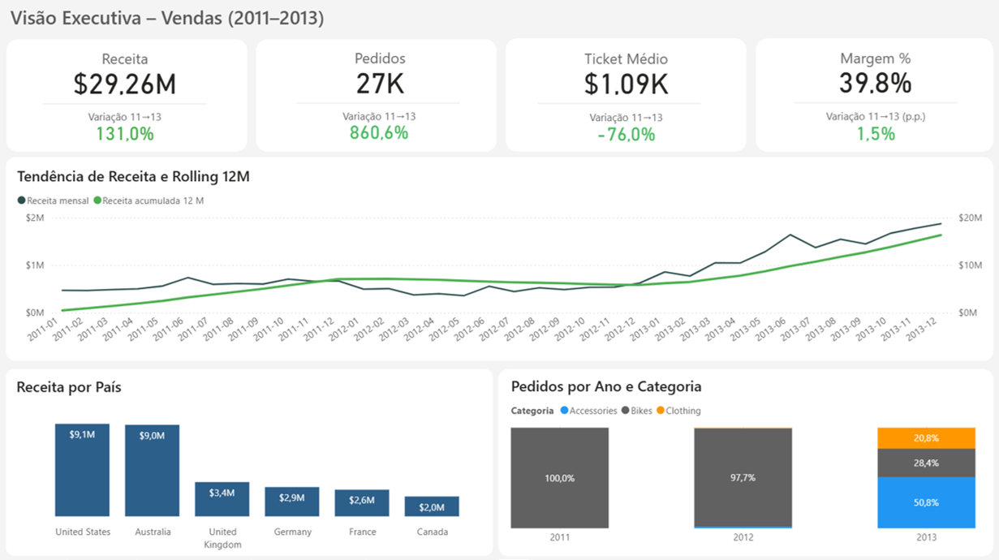
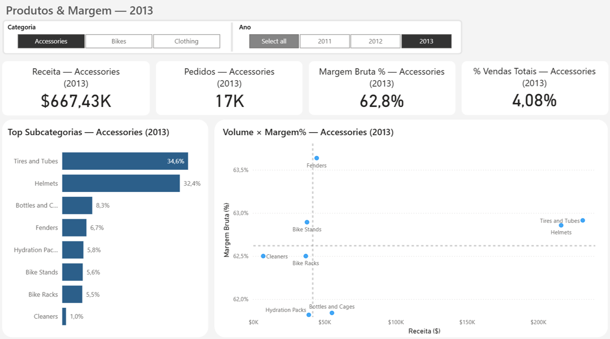
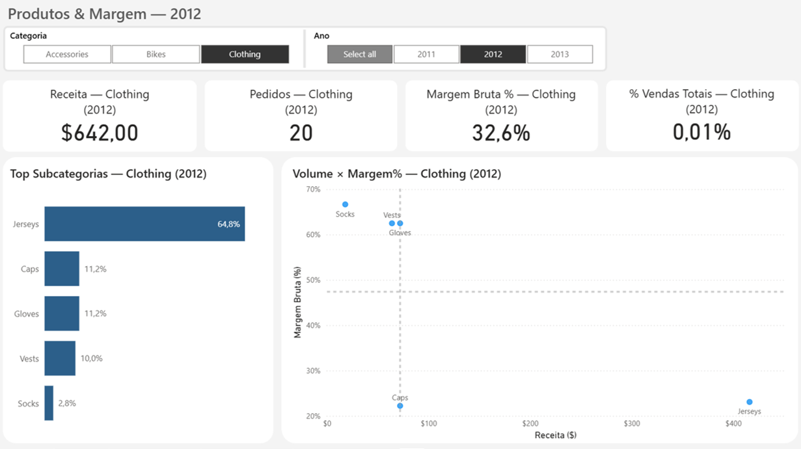
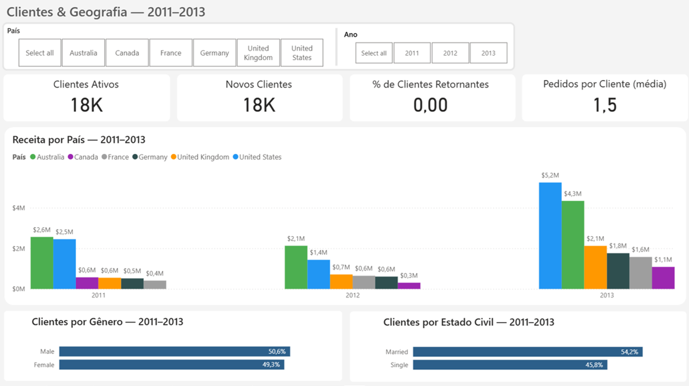
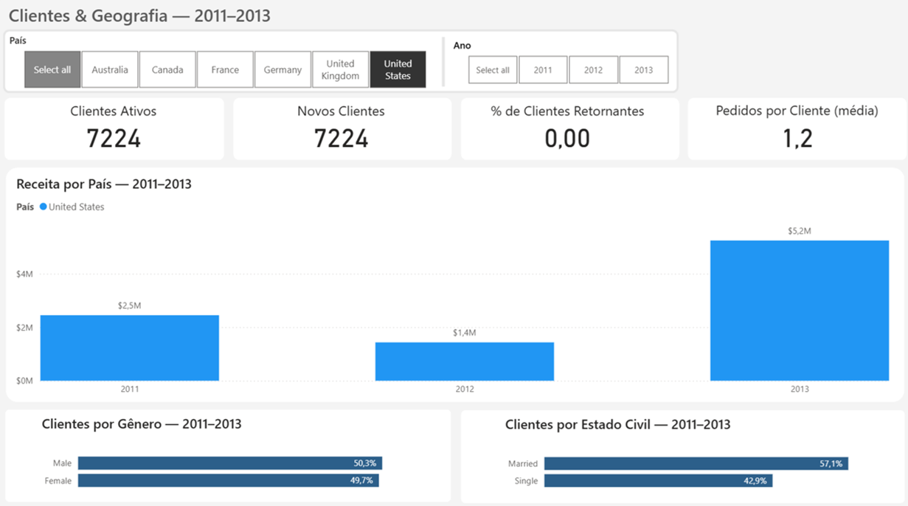
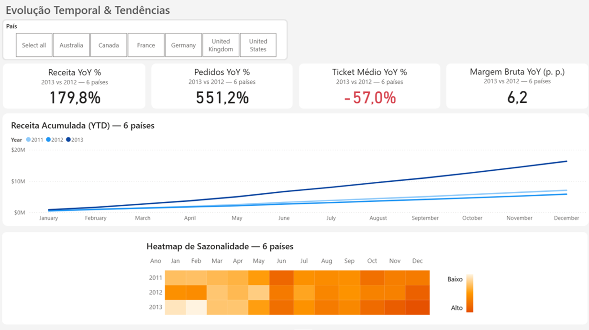
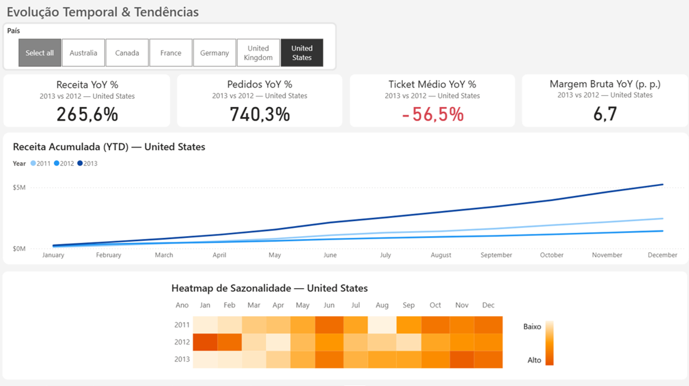

# 📊 Projeto Power BI – Análise de Vendas a partir da Camada Gold

Este projeto complementa o [🏢 projeto-sql-data-warehouse](https://github.com/vivi-alencar/projeto-sql-data-warehouse), demonstrando como a **Camada Gold** pode ser transformada em **dashboards no Power BI** para análise de vendas e suporte à tomada de decisão.  

---

## 🎯 Objetivo

Explorar dados modelados em **esquema estrela (fatos e dimensões)** e traduzi-los em **indicadores de negócio** claros, através de visualizações interativas.  

---

## 🏗️ Arquitetura de Páginas do Dashboard

O dashboard foi estruturado em quatro páginas principais:  

### 1. Página Executiva  
Visão de alto nível da evolução de vendas.  
- KPIs principais: Receita, Pedidos, Ticket Médio, Margem Bruta %.  
- Tendência de Receita Mensal e Rolling 12M.  
- Receita por País.  
- Evolução da composição de pedidos por categoria.  

📷 **Captura de Tela**  
  

---

### 2. Produtos & Margem  
Exploração detalhada por categoria, subcategoria e margem de produtos.  
- KPIs da categoria selecionada.  
- Distribuição da receita por subcategorias.  
- Gráfico de dispersão: volume de vendas × margem %.  
- Slicers: Ano e Categoria.  

📷 **Exemplos com filtros aplicados**  
- Accessories em 2013  
  

- Clothing em 2012  
  

---

### 3. Clientes & Geografia  
Análise da base de clientes e distribuição geográfica das vendas.  
- KPIs: clientes ativos, novos clientes, taxa de retorno, pedidos médios por cliente.  
- Receita por país.  
- Perfil demográfico (gênero, estado civil).  
- Slicers: Ano e País.  

📷 **Visão Geral**  
  

📷 **Filtro aplicado – Estados Unidos**  
  

---

### 4. Tempo & KPIs Avançados  
Avaliação de crescimento YoY, sazonalidade e métricas acumuladas.  
- KPIs YoY: Receita, Pedidos, Ticket Médio, Margem Bruta %.  
- Receita acumulada YTD.  
- Heatmap de sazonalidade (mês × ano).  
- Slicer: País.  

📷 **Visão Geral**  
  

📷 **Filtro aplicado – Estados Unidos**  
  

---

## 📂 Estrutura do Repositório

- **sales_analysis_gold_layer.pbix** → arquivo principal do Power BI  
- **/screenshots/** → capturas de tela das páginas do dashboard  
- **/documentacao/** → documentação complementar  
  - `decisoes.md` → motivações de design/modelagem  
  - `findings.md` → principais insights de negócio  
  - `deck.pdf` → apresentação em slides, simulando como os resultados seriam comunicados em um contexto real  
- **README.md** → este documento  
- **LICENSE** → licença MIT  

---

## 📷 Capturas de Tela

Este repositório inclui prints de cada página do dashboard na pasta [`/screenshots`](./screenshots/).  
Essas imagens mostram tanto a visão geral quanto exemplos de filtros aplicados.  

Para uma experiência narrativa completa, veja também o [📑 deck em PDF](./documentacao/deck.pdf),  
que simula como os resultados poderiam ser apresentados em um contexto real de negócio.

---

## 🔗 Conexão com o Data Warehouse

Este projeto utiliza como fonte a **Camada Gold** modelada no repositório:  
👉 [projeto-sql-data-warehouse](https://github.com/vivi-alencar/projeto-sql-data-warehouse)  

---

## ⚡ Como Abrir

1. Clone este repositório:  
   ```bash
   git clone https://github.com/seu-usuario/projeto-powerbi-data-warehouse.git
   ```
2. Abra o arquivo `sales_analysis_gold_layer.pbix` no **Power BI Desktop (versão 2.147.909.0 ou superior)**.  
3. Certifique-se de ter acesso ao banco ou dados exportados da **Camada Gold**.  

---

## 📎 Créditos

Este dashboard foi construído a partir do modelo de DW inspirado no projeto *SQL Data Warehouse* criado por **Baraa Khatib Salkini**.  
Conteúdo original em:  
🔗 [https://www.datawithbaraa.com](https://www.datawithbaraa.com)  
Licenciado sob a **Licença MIT**.  

---

## 📜 Licença

Este projeto é disponibilizado sob a licença **MIT**.  
Consulte o arquivo [LICENSE](LICENSE) para mais detalhes.  

